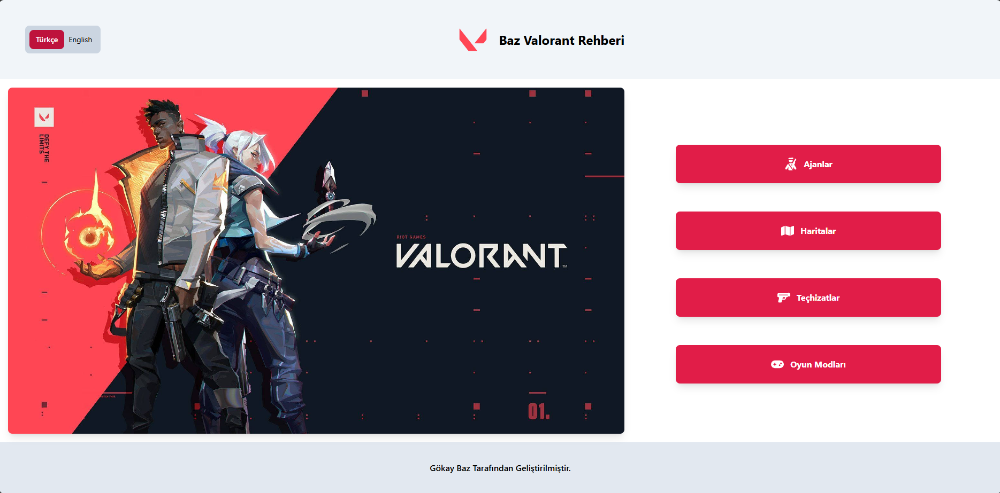
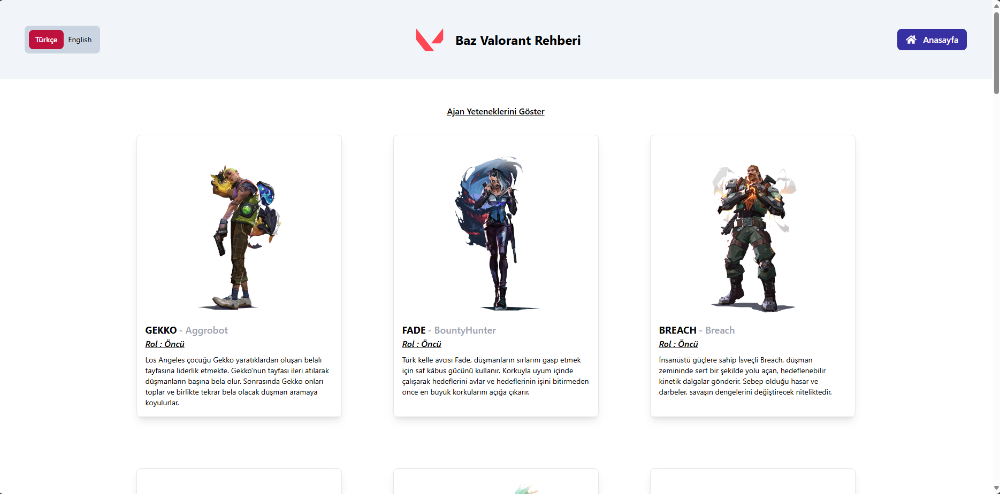
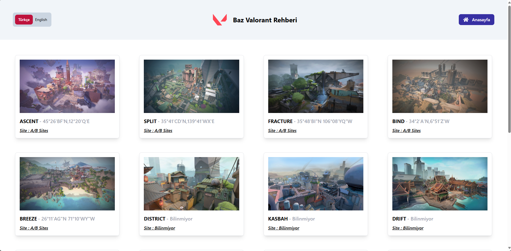
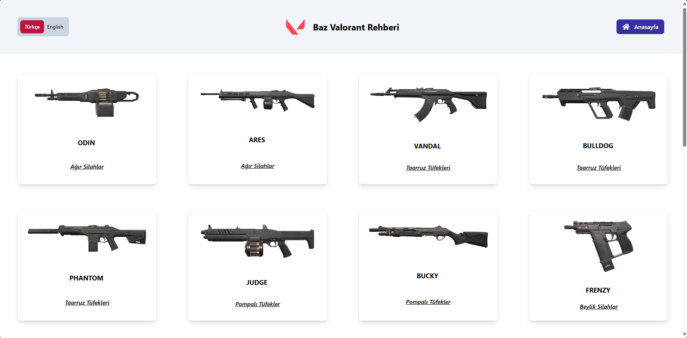
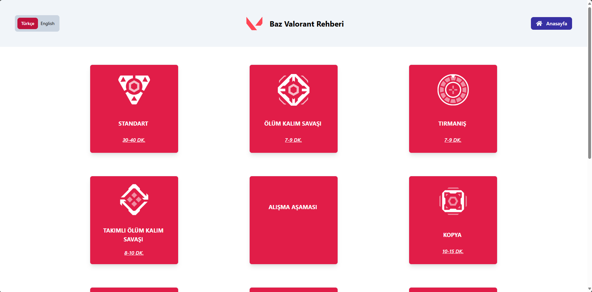
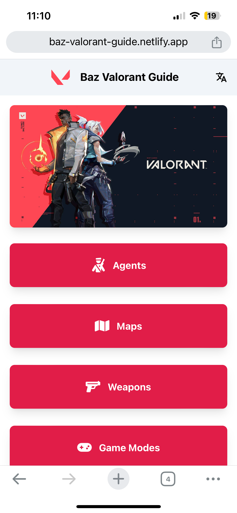
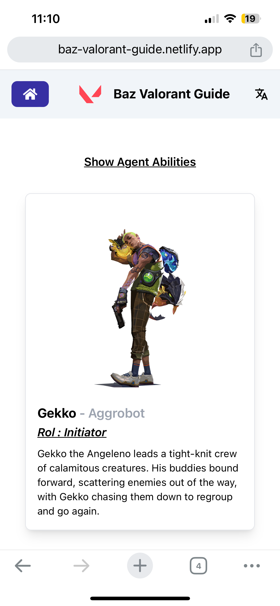
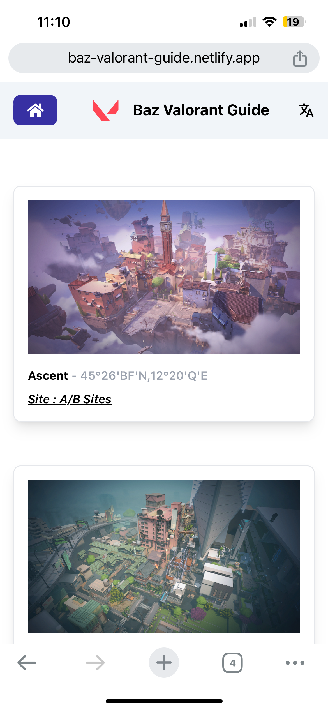
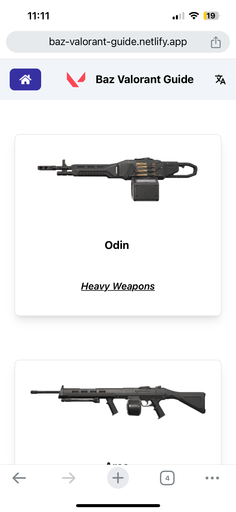
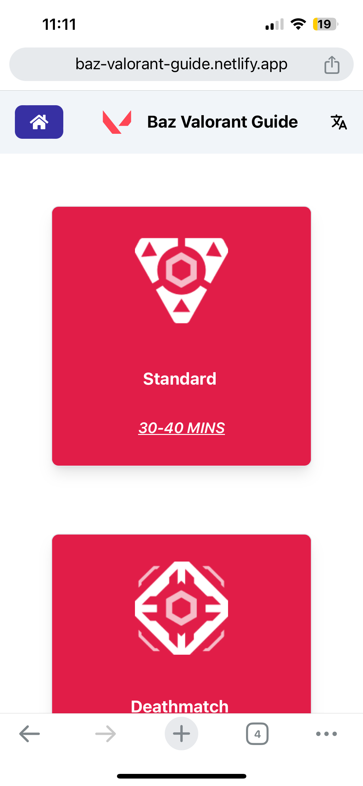

# Baz Valorant Guide App

Valorant Guide App is a ReactJS application designed to help players learn about in-game characters, maps, and strategies. This app aims to provide essential information for users to succeed in Valorant.

## Screenshots
- Desktop






- Mobile







## Features

- **Character Information:** Detailed information on each character's abilities, roles, and in-game tips.
- **Map Guides:** Strategic points, bomb sites, and tactical suggestions for each map.
- **Strategy Tips:** Effective strategy suggestions for different game modes and situations.
- **User-Friendly Interface:** Easy-to-navigate and user-friendly interface design.
- **Responsive Design:** Works seamlessly on all devices.

## Installation

Follow these steps to run the project locally:

1. Clone the repository:
   ```bash
   git clone https://github.com/gokayybaz/baz_valorant_app/
   ```

2. Navigate to the project directory:
   ```bash
   cd baz_valorant_app
   ```

3. Install the necessary dependencies:
   ```bash
   bun install
   ```

4. Start the application:
   ```bash
   bun start
   ```

The app will run on `http://localhost:5173/`.

## Technologies Used

- **ReactJS:** For building the user interface.
- **React Router DOM:** For navigation between pages.
- **Axios:** For managing API calls.
- **TailwindCSS:** For styling.
- **i18next** For app localization.
- **react-icons** For icons.

## Contributing

If you would like to contribute, please create a pull request. We welcome all feedback!

## License

This project is licensed under the MIT License. See the `LICENSE` file for more information.
